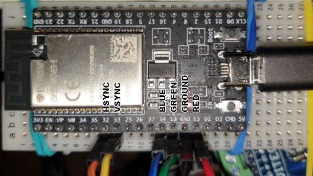
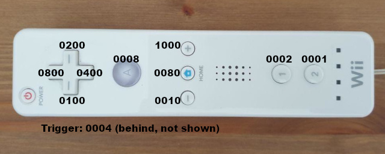

# ZX-ESPectrum-Wiimote

An emulation of the ZX-Spectrum computer on an ESP32 chip with VGA output based on bitluni's driver, using a Wiimote as input device, based on bigw00d's driver.

There are per-game customizable (through simple text files) correspondences from Wiimote keys to Spectrum keys.

## Features

- VGA output, 8 or 16 bits.
- Beeper digital output.
- Accurate Z80 emulation.
- Spectrum 16/48 achitecture emulation without PSRAM.
- Spectrum 128/+2/+3 architecture emulation with PSRAM.
- PS/2 Keyboard.
- Wiimote support with per-game key assignments.
- VGA OSD menu: Configuration, and architecture selection, ROM and SNA.
- Tape save and loading.
- SNA snapshot loading.
- Internal SPIFFS support.

## Work in progress

- AY-3-8910 emulation and sound output with dedicated chip.
- SD card support.
- DivIDE emulation.
- Dedicated motherboard design.
- Joystick support.
- USB keyboard.
- OTA: Over the Air updates.

## Compiling and installing

Windows, GNU/Linux and MacOS/X. This version has been developed using 

#### Install platformIO:

- They have an extension for Atom and VSCode, and this is [the webpage](https://platformio.org/).
- Select your board, I have used a Espressif ESP32-WROVER
- Install Bitluni's ESP32Lib (use version 0.2.1, newer versions such as 0.3.3 will lead to compile errors)

#### Softlink
```bash
ln -s platformio.ini.linux platformio.ini
# or in osx
ln -s platformio.ini.osx platformio.ini
# or in windows
mklink platformio.ini platformio.ini.windows
```

#### Customize platformio.ini

Change upload_port to whatever you're using.
- Linux: `uploadport = /dev/ttyUSB0` or similar.
- Windows: `upload_port = COM1` or similar.
- MacOSX: `upload_port = /dev/cu.SLAB_USBtoUART` or similar.

#### Copy boot.cfg

```bash
cp data/boot.cfg.orig boot.cfg
```

#### Upload the data filesystem

`PlatformIO > Project Tasks > Upload File System Image`

All files under the `/data` subdirectory will be copied to the SPIFFS filesystem partition. Run this task whenever you add any file to the data subdirectory (e.g, adding games in SNA format).

#### Compile and flash it

`PlatformIO > Project Tasks > Build `, then

`PlatformIO > Project Tasks > Upload`.

Run these tasks (`Upload` also does a `Build`) whenever you make any change in the code.

## Hardware configuration and pinout

See ESP32 pin assignment in `include/def/hardware.h` or change it to your own preference.

I have used VGA 3 bit driver (so BRIGHT attribute is lost), but it's simpler to connect and no R-2R DAC is needed. Also, I have assigned pins to bottom side of the ESP32, as it is too wide for usual breadboards.



## Connecting a Wiimote

To connect, press 1 and 2 buttons in the Wiimote.

All 4 leds will flash during connection phase, and only LED 1 will be ON when connected.

## OSD Menu

OSD menu can be opened using the Wiimote's Home key. Navigation is done using the D-Pad, and selection using buttons A, 1 or 2.

From OSD you can load snapshots (from `/data/sna`) or change ROMs.

## Assigning Wiimote keys to emulated Spectrum keys
For every `.sna` game in `/data/sna`, there should be a corresponding `.txt` file in the same dir, with a very simple format. Examples are provided.

The `ESPWiimote` library generates the following codes for Wiimote keys:



The `.txt` file must have at least 16 characters (only first 16 characters are considered). For example for Manic Miner, `ManicMiner.txt` would contain

`sZ-h------WQe---`

There is a character for each possible 16 bit code of wiimote keys, in order: `0001`, `0002`, `0004`, `0008`, `0010`, `0020`, `0040`, `0080`, `0100`, `0200`, `0400`, `0800`, `1000`, `2000`, `4000`, `8000`; and legal characters are:

```
1234567890
QWERTYUIOP
ASDFGHJKLe
hZXCVBNMys
````
With `e` for ENTER, `h` for CAPS SHIFT, `y` for SYMBOL SHIFT and `s` for SPACE. Any other character (ex: '``') means not used.

For the Manic Miner example, the correspondences would be:

```
(2)    (0001) -> SPACE (jump)
(1)    (0002) -> Z     (jump)
(A)    (0008) -> SHIFT (jump)
(down) (0400) -> W     (right)
(up)   (0800) -> Q     (left)
(+)    (1000) -> ENTER (start)

```

I have NOT included Manic Miner `.sna` snapshot, but you can download it from [worldofspectrum.org](https://worldofspectrum.org/archive/software/games/manic-miner-bug-byte-software-ltd) and convert it to `.sna` using [FUSE](http://fuse-emulator.sourceforge.net/), for example.

## Thanks to

- Idea from the work of Charles Peter Debenham Todd: [PaseVGA](https://github.com/retrogubbins/paseVGA).
- VGA Driver from [ESP32Lib by BitLuni](https://github.com/bitluni/ESP32Lib).
- PS/2 keyboard support based on [ps2kbdlib](https://github.com/michalhol/ps2kbdlib).
- Wiimote library from [ESP32Wiimote by bigw00d](https://github.com/bigw00d/Arduino-ESP32Wiimote).
- Z80 Emulation derived from [z80emu](https://github.com/anotherlin/z80emu) authored by Lin Ke-Fong.
- DivIDE ideas (work in progress) taken from the work of Dusan Gallo.
- AY sound hardware emulation from [AVR-AY](https://www.avray.ru/).
- [Amstrad PLC](http://www.amstrad.com) for the ZX-Spectrum ROM binaries [liberated for emulation purposes](http://www.worldofspectrum.org/permits/amstrad-roms.txt).
- [Nine Tiles Networs Ltd](http://www.worldofspectrum.org/sinclairbasic/index.html) for Sinclair BASIC.
- Gary Lancaster for the [+3e ROM](http://www.worldofspectrum.org/zxplus3e/).
- [Retroleum](http://blog.retroleum.co.uk/electronics-articles/a-diagnostic-rom-image-for-the-zx-spectrum/) for the diagnostics ROM.

## And all the involved people from the golden age

- [Sir Clive Sinclair](https://en.wikipedia.org/wiki/Clive_Sinclair).
- [Christopher Curry](https://en.wikipedia.org/wiki/Christopher_Curry).
- [The Sinclair Team](https://en.wikipedia.org/wiki/Sinclair_Research).
- [Lord Alan Michael Sugar](https://en.wikipedia.org/wiki/Alan_Sugar).
- [Investrónica team](https://es.wikipedia.org/wiki/Investr%C3%B3nica).
- [Sovietic cloners](https://en.wikipedia.org/wiki/List_of_ZX_Spectrum_clones).
- Queru's uncle Roberto for introducing him into the microcomputing world with a [Commodore VIC-20](https://en.wikipedia.org/wiki/Commodore_VIC-20).
- Queru's uncle Manolito for introducing him into the ZX-Spectrum world.
- Rampa's mother for the [Oric 1](https://en.wikipedia.org/wiki/Oric#Oric-1) and for inculcate her passion for electronics.
- DCrespo's uncle Pedro for giving him his first computer: a [Sinclair ZX81](https://en.wikipedia.org/wiki/ZX81).

## And all the writters, hobbist and documenters

- [Microhobby magazine](https://es.wikipedia.org/wiki/MicroHobby).
- Dr. Ian Logan & Dr. Frank O'Hara for [The Complete Spectrum ROM Disassembly book](http://freestuff.grok.co.uk/rom-dis/).
- Chris Smith for the The [ZX-Spectrum ULA book](http://www.zxdesign.info/book/).
- Users from [Abadiaretro](https://abadiaretro.com/) and its Telegram group.
- Users from [El Mundo del Spectrum](http://www.elmundodelspectrum.com/) and its Telegram group.
- Users from Hardware Devs group.
- [The World of Spectrum](http://www.worldofspectrum.org/).

## A lot of programmers, especially

- [GreenWebSevilla](https://www.instagram.com/greenwebsevilla/) for its Fantasy Zone game and others.
- Julián Urbano Muñoz for [Speccy Pong](https://www.instagram.com/greenwebsevilla/).
- Others who have donated distribution rights for this project.
